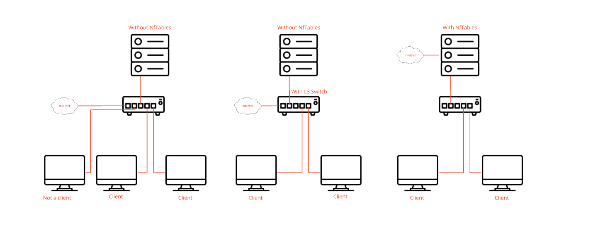

# **OpenClone**


## 1 - What's openClone

Welcome to the "OpenClone" project! This repository contains all the necessary scripts, configurations, and documentation to set up a network boot and cloning system. The primary goal of this project is to facilitate the deployment and maintenance of operating systems across multiple machines within a network, ensuring efficient and streamlined processes.
<br />
<br />
This project was developed as part of my Advanced Technician Certificate (Brevet de Technicien Supérieur, BTS) program. It has allowed me to apply and expand my knowledge in operating systems, networking, and scripting. By leveraging tools like PXE, TFTP, NFS, and various Linux utilities, this project demonstrates a comprehensive approach to network-based system deployment.
<br />
<br />
Feel free to modify it according to your specific needs!

<br />

## 2 - Installation

### 2.1 - Things to Know

The project has an option to deploy link aggregation for better efficiency or nftables (highly recommended for security purposes as it allows you to have a DHCP dedicated to this project).
<br />


<br />
What and Why Aggregation?
<br />
Link aggregation is a method used to combine multiple network connections into a single logical connection to increase throughput and provide redundancy. By deploying link aggregation, you can improve network performance.
<br />
<br />


<br />

<br />
What and Why nftables?
<br />
nftables is a subsystem of the Linux kernel that provides filtering and classification of network packets/datagrams/frames. It is a replacement for the legacy iptables framework and offers several advantages, including better performance, ease of use, and more advanced features. Using nftables can enhance the security of your network by providing more efficient and flexible packet filtering rules.
<br />
<br />


<br />

<br />

### 2.2 - Requirements

You'll need at least 500MB for all the services and some disk storage for the ISOs you want to add.

Debian 12 is the only distribution tested for now (but it should be compatible with all Debian-based distributions).

   - CPU: 2 cores required minimum (4 recommended if you use heavy Iso file)
   - RAM: 500Mo required minimum plus approximatively 256Mo every 3 machines (500Mo for each machines if you use heavy Iso file)

I will test soon on some ranges between:

   - 1-5 machines
   - 5-10 machines
   - 10-30 machines
<br />

### 2.3 - How to install

First, ensure that your machine is up to date:

```
# apt update
# apt upgrade
```

<br />

then to install and start the project:

<br />

```
$ git clone https://github.com/Matheo2604/openClone
$ cd openClone/
# bash install.sh 
```

## 3 - Usage

The project is managable through the web interface or in CLI (Script will be made to make the user admin experiences easier)

### 3.1 - How to Boot in PXE Mode

You'll need to enable PXE or Network boot in your Bios/UEFI it's advise to for people that's going to use frequently ISO to put Pxe/Network boot first in there boot order

### 3.2 - How to Use Our Maintenance Linux

When booting on your client machine choose to boot on the "Maintenance Linux" option, then you'll have a graphical interface to manage your client or you can chose tu use CLI to use your own commande

### 3.3 - How to Add an OS


## 4 - Troubleshooting
